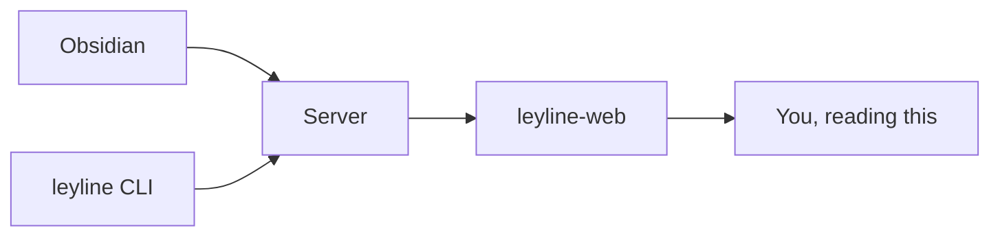

# Markdown rendering

The web reader renders Obsidian-flavored Markdown — the syntax is Obsidian's, but the reader renders whatever is in the vault, however it got there (plugin, CLI, plain text editor, or CI). A taste:

**Wikilinks** — [[interoperability|jump back to interoperability]].

**Embeds** — `![[image.png|300]]` lifts the size onto the `` tag. Add
`![[image.png|theme-dark]]` to show an image only in dark (or `theme-light`)
mode — pair both to swap automatically as you toggle the theme. The diagram
below is two SVGs, one per mode; toggle the theme and watch it swap:

![[diagram-dark.svg|theme-dark]]
![[diagram-light.svg|theme-light]]

**Callouts:**

> [!note]
> Foldable and non-foldable. The title accepts inline markdown.

**Math** — inline `$E = mc^2$` and block:

$$
\int_0^\infty e^{-x^2}\,dx = \frac{\sqrt{\pi}}{2}
$$

Inline math renders too: $e^{i\pi} + 1 = 0$.

Chemistry via mhchem (KaTeX can't parse this — it exercises the MathJax fallback): $\ce{2H2 + O2 -> 2H2O}$

**Mermaid:**

**Task lists**, including the Obsidian Tasks plugin format:

- [ ] Open a vault in Obsidian
- [x] Read this page
- [ ] Try the dark/light toggle

**Highlights** — ==marked text== renders as `<mark>`.

**Inline tags** — `#quickstart`, `#leyline`.

**Kanban** — the Obsidian Kanban plugin stores boards as Markdown with `kanban-plugin: basic` in frontmatter; those files render as plain task lists today, with board rendering on the way.

---

For the full parity matrix — every feature, shipped and planned — see [[@documentation/reference/obsidian-markdown-parity|Obsidian Markdown parity]].
